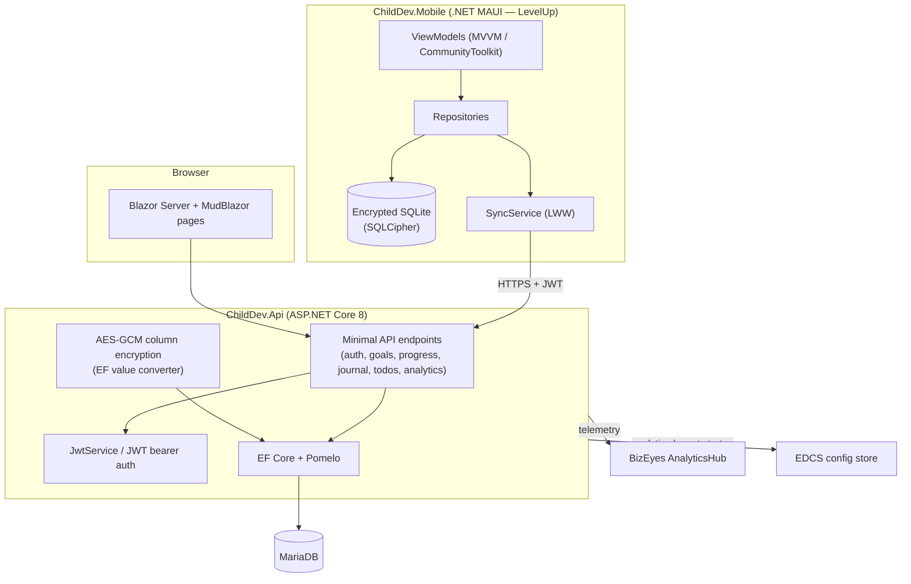

# ChildDev

> Helps kids set and achieve developmental goals — with a mobile app, a web companion, and offline-first sync.


## Overview

ChildDev is a goal-achievement tracker for children and their caregivers. The **Goal** is the
central entity; everything else exists to make progress toward goals visible:

- **Goals** — developmental goals set by kids or caregivers, with category, pinning, steps, and a progress percentage.
- **GoalProgress** — progress notes and next-step items recorded against a goal.
- **Journal** — free-form observations that add context around goals.
- **Todos** — tasks that help achieve goals.

The system has three parts that share one data model:

- A **.NET MAUI** mobile app (`LevelUp`) that works fully offline against an encrypted local SQLite
  database and syncs to the API.
- An **ASP.NET Core 8 minimal API** that persists data in MariaDB and exposes sync endpoints.
- A **Blazor Server + MudBlazor** web companion, hosted inside the same API project, for using the
  app from a browser.

Sync is **offline-first** with a **Last-Write-Wins (LWW)** strategy keyed on an `UpdatedOn`
Unix-millisecond timestamp, and soft deletes via a `DeletedAt` field.

## Architecture



## Features

- Goals as the primary entity, with categories, pinning, steps, and progress percentage.
- Per-goal progress notes and next-step items (`GoalProgress`).
- Free-form journal entries and goal-supporting todos.
- Offline-first mobile app with Last-Write-Wins sync and soft deletes.
- NickName + PIN authentication (BCrypt-hashed) shared by mobile and web.
- JWT bearer auth on the API; session-based auth for the Blazor web UI.
- Encryption at rest: AES-GCM-encrypted free-text columns server-side (transparent legacy-plaintext
  reads); fully encrypted SQLCipher database on mobile with a per-device key in `SecureStorage`.
- Tenant isolation via EF Core global query filters keyed to the current account.
- Reminders with local notifications on mobile.
- Usage analytics, with optional forwarding to an external BizEyes AnalyticsHub.
- Health endpoint (`/api/health`) with a database connectivity check.

## Tech stack

| Layer | Technology |
| --- | --- |
| API | ASP.NET Core 8 minimal API |
| ORM | EF Core 8 with Pomelo MySQL/MariaDB provider |
| Database (server) | MariaDB 11 |
| Web UI | Blazor Server (interactive server rendering) + MudBlazor |
| Mobile | .NET MAUI (`net8.0-android` + `net8.0`) |
| Mobile data | sqlite-net-sqlcipher (encrypted SQLite), CommunityToolkit.Mvvm |
| Auth | JWT bearer (`Microsoft.AspNetCore.Authentication.JwtBearer`), BCrypt password hashing |
| Notifications | Plugin.LocalNotification (mobile) |
| Config / analytics | Edcs.AppConfig.Client, BizEyes AnalyticsHub |
| Tests | xUnit (API integration + mobile unit), Playwright (web E2E) |
| Hosting | Docker Compose, Traefik (Let's Encrypt via Cloudflare DNS), nginx |

## Project structure

```text
.
├── ChildDev.Api/            ASP.NET Core 8 API + Blazor Server web UI
│   ├── Components/           Blazor pages, layout, routes
│   ├── Data/                 AppDbContext, encrypted-string converter
│   ├── Endpoints/            Minimal API endpoints (auth, goals, journal, todos, analytics)
│   ├── Models/               Entities and DTOs
│   ├── Services/             JWT, encryption, analytics, reminders, email, EDCS/BizEyes
│   ├── wwwroot/              Static assets, app downloads
│   └── Dockerfile
├── ChildDev.Api.Tests/      xUnit API integration tests
├── ChildDev.Mobile/         .NET MAUI app (LevelUp.csproj)
│   ├── Views/ ViewModels/    MVVM pages and view models
│   ├── Data/                 Encrypted local SQLite repositories
│   ├── Services/             Sync, account, reminders, analytics, key provider
│   └── Platforms/            Android, iOS, MacCatalyst, Windows, Tizen
├── ChildDev.Mobile.Tests/   xUnit mobile unit tests
├── playwright/              Playwright web E2E tests
├── scripts/                 Build/deploy/Android-VM helper scripts
├── docs/                    Design specs and implementation plans
├── docker-compose.yml       Traefik + API + MariaDB + downloads
└── ChildDev.sln
```

## Getting started

### Prerequisites

- .NET 8 SDK
- MariaDB (or use the bundled Docker Compose stack)
- For the mobile app: the .NET MAUI workload and the Android SDK

### Run the API + web UI

```bash
# Set required configuration (see Configuration below)
export CHILDDEV_JWT_SECRET="<a long random secret>"
export CHILDDEV_ENC_KEY="<base64 32-byte AES key>"   # openssl rand -base64 32
export CHILDDEV_DB_CONNECTION="Server=localhost;Database=childdev;User=childdev;Password=dev;"

dotnet run --project ChildDev.Api
```

The API serves the Blazor web UI, the minimal-API endpoints, and a health check at `/api/health`.
The schema is created/updated at startup via `EnsureCreated()` (no migration files).

### Run with Docker Compose

```bash
export CHILDDEV_ENC_KEY="$(cat ~/data/.secrets/levelUp.enckey)"
# plus CHILDDEV_JWT_SECRET, CHILDDEV_DB_CONNECTION, MARIADB_ROOT_PASSWORD, etc.
docker compose up -d --build
```

The Compose stack runs Traefik (TLS via Let's Encrypt / Cloudflare DNS), the API, MariaDB, and an
nginx downloads service.

### Build / test the mobile app

```bash
# Run mobile unit tests without the MAUI workload targets
MSBuildEnableWorkloadResolver=false \
  dotnet test ChildDev.Mobile.Tests/ChildDev.Mobile.Tests.csproj /p:SkipMauiTargets=true
```

### Tests

```bash
dotnet test ChildDev.Api.Tests          # API integration tests
cd playwright && npm install && npx playwright test   # web E2E
```

## Configuration

Configuration is read from environment variables (see `.env.example`):

| Variable | Required | Purpose |
| --- | --- | --- |
| `CHILDDEV_JWT_SECRET` | Yes | Symmetric signing key for JWT bearer tokens. The API fails fast if unset. |
| `CHILDDEV_ENC_KEY` | Yes | Base64 32-byte AES key for at-rest column encryption. The API fails fast if unset. |
| `CHILDDEV_DB_CONNECTION` | No | MariaDB connection string (defaults to a local dev connection). |
| `CHILDDEV_CORS_ORIGIN` | No | Allowed CORS origin (defaults to `http://localhost:4200`). |
| `MARIADB_ROOT_PASSWORD` / `CHILDDEV_DB_PASSWORD` | Compose | Database passwords for the Compose stack. |
| `Edcs__*` | No | EDCS config store (soft dependency) used to fetch the analytics key at startup. |
| `BizEyes:*` | No | External AnalyticsHub forwarding (disabled when the key is empty). |

> The real encryption key is never committed — it lives only in a gitignored secrets file and must
> be identical across dev and prod.

<sub>README authored by Claude.</sub>
